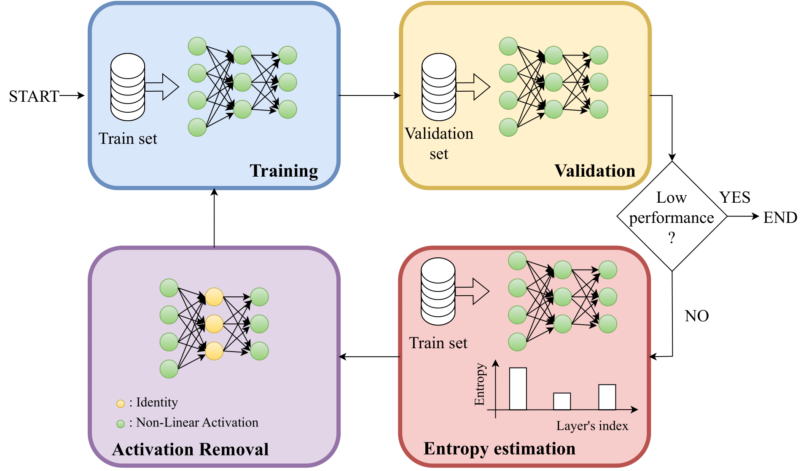

# The Simpler The Better: An Entropy-Based Importance Metric To Reduce Neural Networks' Depth

[](https://arxiv.org/abs/2404.18949.pdf)

This GitHub implements the key experiments of the following paper: [The Simpler The Better: An Entropy-Based Importance Metric To Reduce Neural Networks' Depth](https://arxiv.org/abs/2404.18949.pdf), and more particularly of our method relying on an **E**ntropy-b**AS**ed **I**mportance m**E**t**R**ic (**EASIER**) to reduce the depth of over-parametrized deep neural networks.    

<p align="center">
  
</p>

## Libraries
* Python = 3.10
* PyTorch = 1.13
* Torchvision = 0.14
* Numpy = 1.23

## Usage

In practice, you can begin with a set of defaults and optionally modify individual hyperparameters as desired. To view the hyperparameters for each subcommand, use the following command. 
```
main.py [subcommand] [...] --help
```

## Example Runs

To test our EASIER method with a ResNet-18 on CIFAR-10, optimized with SGD for 160 epochs, momentum of 0.9, batch size of 128, learning rate 0.1, milestones 80 and 120, drop factor of 0.1 and weight decay 1e-4:

```python main.py --root YOUR_PATH_TO_CIFAR --dir_to_save_checkpoint YOUR_PATH_TO_CHECKPOINTS```

To run EASIER on a Swin-T trained on Flowers-102, optimized with Adam for 50 epochs with a learning rate of 1e-4, batch size of 16, and weight decay 0:

```python main.py --root YOUR_PATH_TO_FLOWERS --dir_to_save_checkpoint YOUR_PATH_TO_CHECKPOINTS --model Swin-T --dataset Flowers-102 --optimizer Adam --epochs 50 --lr 1e-4 --batch_size 16 --wd 0```

## List of available datasets

- CIFAR-10
- Tiny-ImageNet-200
- PACS
- VLCS
- Flowers-102
- DTD
- Aircraft

## List of available architectures

- VGG-16 (bn version)
- ResNet-18
- Swin-T
- MobileNetv2

## Appendix of the paper

Please find attached the appendix of the paper at [appendix.md](appendix.md).

## Citation

If you find this useful for your research, please cite the following paper.
```
@article{quetu2024simpler,
  title={The Simpler The Better: An Entropy-Based Importance Metric To Reduce Neural Networks' Depth},
  author={Qu{\'e}tu, Victor and Liao, Zhu and Tartaglione, Enzo},
  journal={arXiv preprint arXiv:2404.18949},
  year={2024}
}
```
